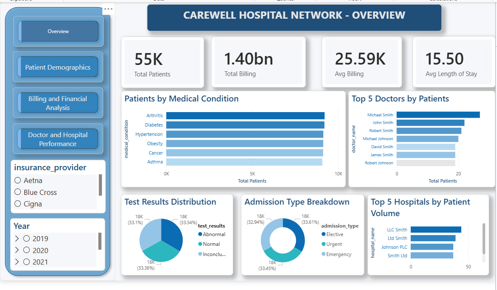
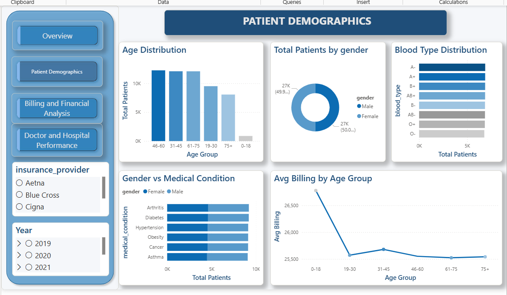
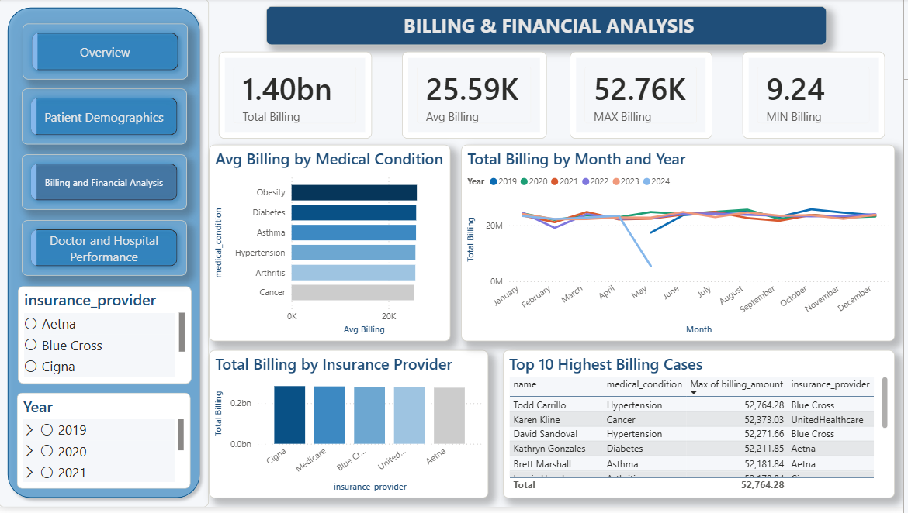
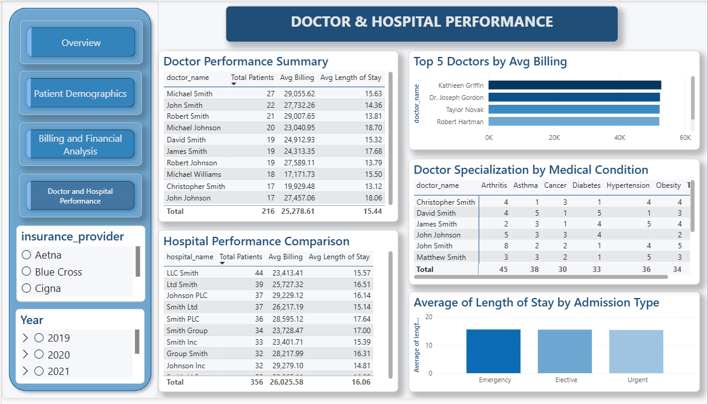

# 🏥 Healthcare Data Analysis Project

End-to-end data analysis project on a hospital network's patient, billing, and operational data — built using **Python**, **PostgreSQL**, and **Power BI**.

---

##  Project Overview

**Client (Simulated):** CareWell Hospital Network — Chief Operations Officer (COO)

**Problem Statement:**
> Our hospital network is facing challenges in understanding patient demographics, managing billing efficiently, tracking doctor performance, and optimizing bed occupancy. We need a comprehensive data analysis report and an interactive dashboard that helps our management team make faster, data-driven decisions.

**Dataset:** [Healthcare Dataset – Kaggle](https://www.kaggle.com/datasets/prasad22/healthcare-dataset) (54,860 patient admission records)

---

##  Tools & Technologies

| Tool | Purpose |
|---|---|
| **Python (Pandas, Google Colab)** | Data cleaning and preprocessing |
| **PostgreSQL (pgAdmin)** | Database normalization and SQL querying |
| **Power BI** | Interactive dashboard and data visualization |
| **GitHub** | Project documentation and version control |

---

##  Project Workflow

```
Kaggle Dataset (raw CSV)
        ↓
Python — Data Cleaning (Pandas)
        ↓
PostgreSQL — Database Normalization (5 tables, primary/foreign keys)
        ↓
SQL — 22 queries answering 18 business questions
        ↓
Power BI — 4-page interactive dashboard
```

---

##  Data Cleaning (Python)

Performed in Google Colab using Pandas:
- Removed duplicate records
- Converted date columns to proper datetime format
- Standardized text fields (names, gender, blood type, medical conditions) to consistent casing
- Removed invalid records (zero/negative billing, unrealistic ages)
- Created derived columns: **Length of Stay**, **Age Group**

---

##  Database Design (PostgreSQL)

The raw single-table dataset was **normalized into 5 relational tables** to demonstrate proper database design and SQL JOIN skills:

| Table | Description |
|---|---|
| `patients` | Patient demographic details |
| `doctors` | Unique doctor records |
| `hospitals` | Unique hospital records |
| `insurance` | Unique insurance provider records |
| `admissions` | Fact table linking all dimensions with billing, dates, conditions, and outcomes |

**Relationships:** One-to-many from each dimension table (`patients`, `doctors`, `hospitals`, `insurance`) to the central `admissions` fact table.

---

##  SQL Analysis

22 SQL queries were written across 5 business categories to directly answer the client's questions, covering:
- Aggregations (`COUNT`, `AVG`, `SUM`, `MIN`, `MAX`)
- Multi-table `JOIN`s across all 5 tables
- Window functions (`RANK() OVER (PARTITION BY ...)`)
- Subqueries with `STDDEV` for outlier detection
- `CASE WHEN` conditional aggregation
- Date arithmetic and `EXTRACT()` for time-based trends
- `HAVING` clause filtering on aggregated results

 
---

##  Power BI Dashboard

A 4-page interactive dashboard with consistent navigation, a single-hue blue color theme, and cross-filtering slicers (Insurance Provider, Year).

### Page 1 — Overview

High-level KPIs (Total Patients, Total Billing, Avg Billing, Avg Length of Stay), patient volume by medical condition, admission type breakdown, test result distribution, and top-performing hospitals.

### Page 2 — Patient Demographics

Age distribution, gender split, blood type distribution, gender vs. medical condition cross-analysis, and average billing by age group.

### Page 3 — Billing & Financial Analysis

Billing KPIs, average billing by medical condition and admission type, monthly billing trends by year, billing by insurance provider, and a table of the highest billing cases.

### Page 4 — Doctor & Hospital Performance

Doctor performance summary (patient volume, average billing, average length of stay), doctor specialization by medical condition, hospital performance comparison, and length of stay by admission type.

 Power BI file: [`powerbi/Healthcare_Dashboard.pbix`](Carewell_hospital_network_analysis.pbix)

---

## 💡 Key Insights

- **Balanced condition mix:** The five most common medical conditions (Arthritis, Diabetes, Hypertension, Obesity, Cancer) are each treated at a nearly identical rate (~16–17% of admissions), indicating no single condition dominates hospital resources.
- **Even admission load:** Elective, Emergency, and Urgent admissions are split almost evenly (~33% each), suggesting admission type does not significantly skew capacity planning.
- **Billing scales with care complexity:** Certain conditions and admission types consistently show higher average billing, useful for cost forecasting and insurance negotiation.
- **Length of stay varies by admission type:** Emergency admissions show a measurably different average length of stay compared to Elective and Urgent cases, an operational signal for bed management.
- **Test result split:** Roughly a third of all patients fall into Abnormal, Normal, and Inconclusive categories respectively, highlighting an opportunity to investigate testing/diagnostic consistency.
- **Doctor performance varies meaningfully:** Some doctors manage significantly higher patient volumes or average billing than others, useful for workload balancing and performance review.
- **Hospital-level performance differs:** Comparing hospitals on patient volume, average billing, and average length of stay together (rather than volume alone) reveals which locations are both high-traffic and high-efficiency.
- **Data limitation noted:** Available records span June 2019 through May 2024; 2019 and 2024 are partial years and were noted accordingly in the time-trend analysis to avoid misleading comparisons.


---

##  Skills Demonstrated

`Data Cleaning` · `Python (Pandas)` · `Database Normalization` · `PostgreSQL` · `SQL Joins` · `Window Functions` · `Subqueries` · `Power BI` · `DAX Measures` · `Data Visualization` · `Dashboard Design`

---

## 👤 Author

Built as a portfolio project to demonstrate end-to-end data analysis capability — from raw data to business-ready dashboards.
